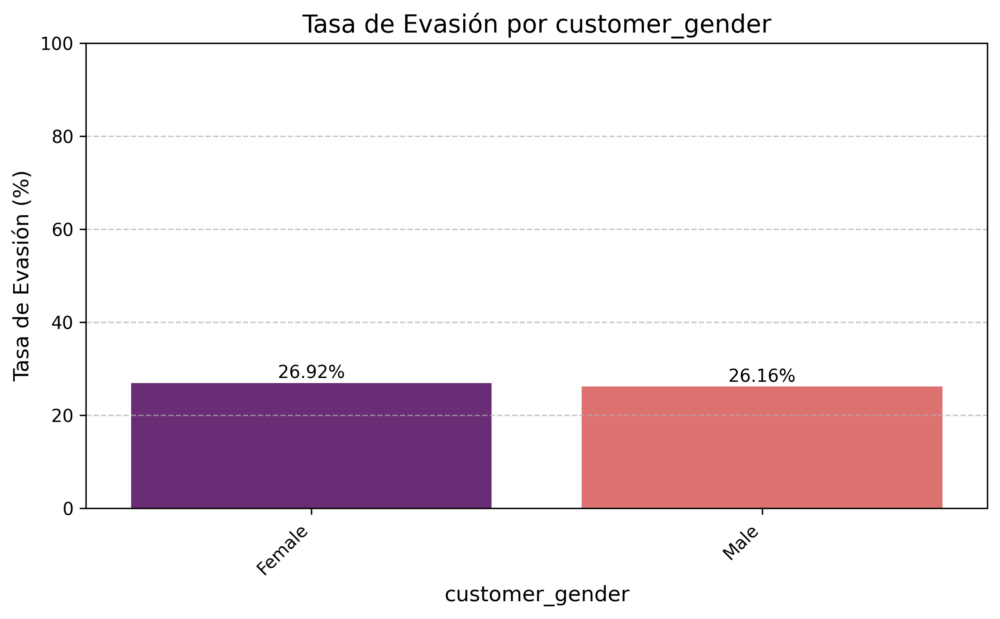
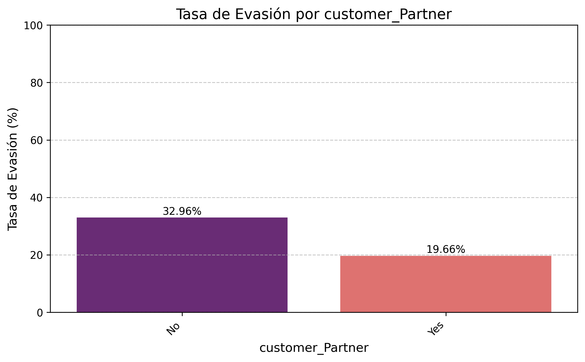
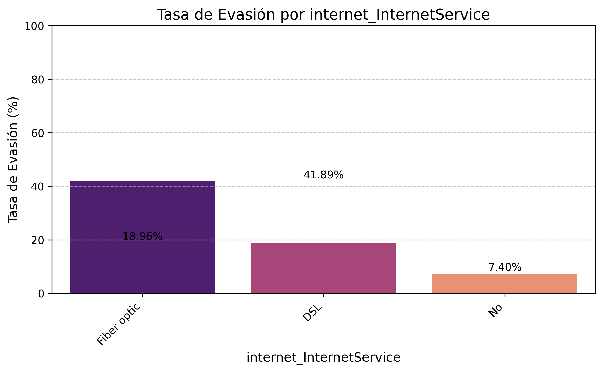
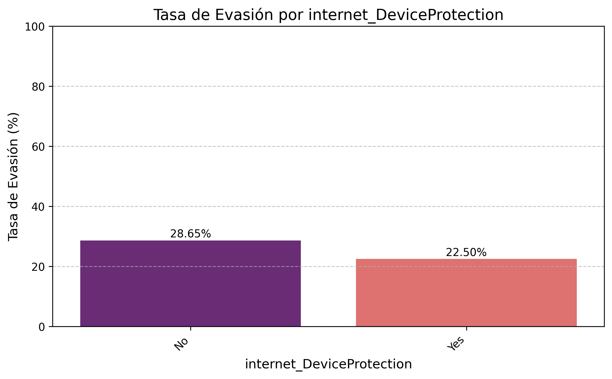

# 📉 Análisis de Evasión de Clientes (Churn) en Telecom X

---

### Introducción: El Desafío de Telecom X

En el vibrante pero competitivo mundo de las telecomunicaciones, **Telecom X** se enfrentaba a un misterio creciente: sus clientes se estaban yendo, y nadie sabía exactamente por qué. Como el nuevo asistente de análisis de datos, mi misión era clara: desentrañar los factores detrás de esta **evasión de clientes (Churn)** y transformar montañas de datos en ideas claras y accionables. Este proyecto es la historia de cómo, paso a paso, iluminamos las razones detrás de la partida de los clientes, preparando el terreno para que Telecom X no solo entienda el problema, sino que lo resuelva.

---

### 🚀 El Viaje de los Datos: Extracción, Transformación y Carga (ETL)

Nuestra aventura comenzó en la **fase de Extracción (Paso 1)**. Como exploradores digitales, nos sumergimos en las profundidades de la API de Telecom X, donde se escondía la valiosa información de los clientes en formato JSON. Con Python y la astucia de `requests` y `pd.json_normalize()`, rescatamos estos datos, aplanando sus estructuras anidadas para que cada detalle tuviera su propio lugar en nuestro mapa, un **DataFrame de Pandas**.

Una vez que los datos estaban a bordo, nos adentramos en la **Transformación (Pasos 2, 3, 4 y 6)**. Este fue el momento de conocer a fondo a nuestros "compañeros de viaje": las columnas. Examinamos sus tipos, buscando cualquier inconsistencia o dato faltante (Paso 3), como el temido `account.Charges.Total` que se resistía a ser un número. Como detectives, identificamos duplicados y aplicamos las correcciones necesarias (Paso 4), rellenando vacíos y asegurándonos de que cada pieza de información fuera precisa.

Un paso crucial en nuestra transformación fue la **estandarización y la mejora de la legibilidad (Paso 6)**. Nombres complejos como `account.Charges.Monthly` se convirtieron en `account_Charges_Monthly`, facilitando la conversación con nuestros datos. También convertimos respuestas de "Sí"/"No" en 1s y 0s, el lenguaje universal de las matemáticas, y las distintas formas de "no servicio" se unificaron para mantener la coherencia. ¡Incluso creamos una nueva columna, **`Cuentas_Diarias` (Paso 5)**, para tener una visión granular de los gastos de cada cliente!

---

### 🔍 El Corazón del Misterio: Análisis Exploratorio de Datos (EDA)

Con un conjunto de datos impecable, era hora de la verdad: el **Análisis Descriptivo (Paso 7)** y el **Análisis Exploratorio de Datos (EDA)**. Aquí, cada gráfico y cada número nos contaban una parte de la historia de la evasión.

#### La Proporción de la Evasión (Paso 8)

El primer vistazo nos dio una imagen general: 쯖uántos clientes se estaban yendo?

**Insight:** Esta visualización nos da la tasa base de churn, el porcentaje de clientes que deciden irse. Es nuestro punto de partida para entender la magnitud del problema en Telecom X.

#### Las Variables Numéricas Hablan (Paso 10)

Las cifras a menudo revelan tendencias sorprendentes. Nos enfocamos en variables como la antigüedad del cliente (`customer_tenure`), los cargos mensuales (`account_Charges_Monthly`) y los cargos totales (`account_Charges_Total`).

**Insight:** Los clientes con menor antigüedad (las barras de los primeros meses) muestran una propensión mucho mayor a evadir. Los primeros meses son críticos para la retención.

**Insight:** Observamos que los clientes con cargos mensuales más altos, especialmente en ciertos rangos, tienden a evadir más. Esto podría sugerir una sensibilidad al precio o una percepción de menor valor por el costo.

**Insight:** Al igual que con la antigüedad, los clientes con menores cargos totales acumulados son más propensos a la evasión, lo que refuerza la idea de que los clientes más "viejos" y con mayor gasto son más estables.

**Insight:** La distribución de los cargos diarios refleja de cerca la de los cargos mensuales, proporcionando una visión más granular que confirma los patrones observados.

#### Las Variables Categóricas Revelan Patrones (Paso 9)

Las categorías de servicio, tipo de contrato y método de pago pintaron un cuadro claro de quiénes son los clientes en riesgo.

**Insight:** El género no parece ser un factor determinante en la evasión, con tasas de churn muy similares entre hombres y mujeres.

**Insight:** Los clientes Senior (de edad avanzada) muestran una tasa de evasión ligeramente mayor, lo que podría sugerir necesidades o desafíos específicos para este segmento.

**Insight:** Los clientes sin pareja (`No`) tienden a tener una tasa de evasión más alta que aquellos con pareja (`Yes`), lo que sugiere que la presencia de un compañero podría influir en la estabilidad del servicio.

**Insight:** Similar a los socios, los clientes sin dependientes muestran una tasa de churn ligeramente más alta, posiblemente indicando que las personas con mayores responsabilidades familiares valoran más la estabilidad del servicio.

**Insight:** Parece que tener servicio telefónico (`Yes`) reduce ligeramente la tasa de evasión en comparación con no tenerlo (`No`), aunque la diferencia no es drástica.

**Insight:** Los clientes con múltiples líneas telefónicas parecen evadir menos que aquellos con una sola línea o sin servicio telefónico, lo que podría indicar un mayor compromiso.

**Insight:** **¡Alerta!** Los clientes con **Fibra óptica** tienen la tasa de evasión más alta. Esto es un hallazgo crítico, ya que este servicio a menudo es premium y podría indicar problemas de calidad, expectativas no cumplidas o mejores ofertas de la competencia.

**Insight:** Claramente, los clientes que *no* tienen seguridad online evaden mucho más. Los servicios de seguridad actúan como un fuerte factor de retención.

**Insight:** Los clientes sin protección de dispositivo son más propensos a evadir. Esto subraya la importancia de la tranquilidad para el cliente.

**Insight:** La falta de soporte técnico es un claro predictor de evasión. Los clientes valoran la capacidad de resolver problemas fácilmente.

**Insight:** Los clientes que no tienen streaming de TV tienden a evadir más, sugiriendo que la oferta de entretenimiento contribuye a la retención.

**Insight:** Similar al streaming de TV, la ausencia de streaming de películas se asocia con una mayor tasa de evasión.

**Insight:** **¡Hallazgo crucial!** Los clientes con contratos **"Month-to-month" (mes a mes)** tienen una tasa de evasión extraordinariamente alta, lo que indica que la falta de compromiso a largo plazo es un factor de riesgo masivo.

**Insight:** Los clientes con facturación sin papel muestran una tasa de evasión ligeramente más alta. Podría ser que este grupo sea más "digital" y, por lo tanto, más propenso a buscar alternativas en línea.

**Insight:** El "Cheque electrónico" tiene la tasa de evasión más alta, lo que podría indicar un perfil de cliente diferente o un método de pago que facilita la cancelación.

---

### 🔗 Análisis de Correlación entre Variables (Paso 12 - Extra)

Finalmente, para entender cómo las variables numéricas se mueven juntas y su relación con la evasión, generamos una matriz de correlación.

**Insight:** La matriz confirma visualmente las relaciones. Vemos una fuerte correlación negativa entre la antigüedad (`customer_tenure`) y el `Churn`, lo que significa que cuanto más tiempo está un cliente, menos probable es que se vaya. Los cargos mensuales (`account_Charges_Monthly`) tienen una correlación positiva con `Churn`, mientras que los cargos totales (`account_Charges_Total`) tienen una correlación negativa, lo que refuerza los hallazgos de los histogramas.

---

### 💡 Conclusiones y Recomendaciones (Paso 11)

Nuestro viaje a través de los datos de Telecom X ha revelado verdades fundamentales sobre la evasión de clientes.

#### 🔹 Conclusiones Clave:

* **Los Clientes Recientes son Vulnerables:** La mayor parte de la evasión ocurre en los primeros meses.
* **La Flexibilidad del Contrato, un Riesgo:** Los contratos mes a mes son el mayor factor de riesgo.
* **Valor Añadido = Lealtad:** La falta de servicios de seguridad y soporte impulsa la evasión.
* **Fibra Óptica: Calidad vs. Churn:** A pesar de ser un servicio premium, la fibra óptica tiene una alta tasa de evasión, lo que sugiere problemas subyacentes.

#### 🔹 Recomendaciones Estratégicas:

1.  **Programa de Bienvenida Robusto:** Implementar un programa intensivo de **incorporación y seguimiento** para los nuevos clientes durante los primeros 6 meses, ofreciendo soporte proactivo y encuestas de satisfacción.
2.  **Incentivos a Contratos a Largo Plazo:** Crear ofertas atractivas (descuentos, beneficios adicionales) para migrar a clientes de "mes a mes" a contratos de 1 o 2 años.
3.  **Venta Cruzada de Servicios Esenciales:** Impulsar activamente la adquisición de servicios como **seguridad en línea, respaldo y soporte técnico**, destacando sus beneficios y la tranquilidad que ofrecen.
4.  **Investigación de Calidad en Fibra Óptica:** Realizar un análisis más profundo de los clientes de fibra óptica que evaden. Esto podría implicar encuestas de calidad de servicio, análisis de quejas específicas o revisión de la competitividad de precios en este segmento.
5.  **Análisis de Método de Pago:** Investigar el perfil y las razones de evasión de los clientes que utilizan "Cheque electrónico" como método de pago para identificar posibles puntos de fricción o insatisfacción.

Este informe no es solo el fin de nuestro análisis, sino el inicio de una estrategia más inteligente y orientada a datos para que Telecom X no solo recupere, sino que retenga a sus valiosos clientes.